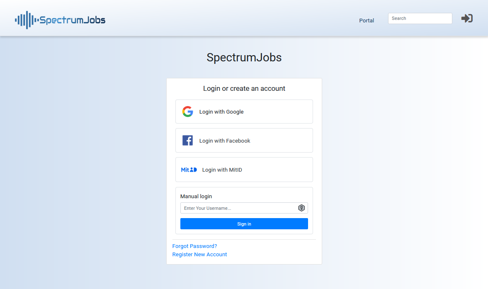
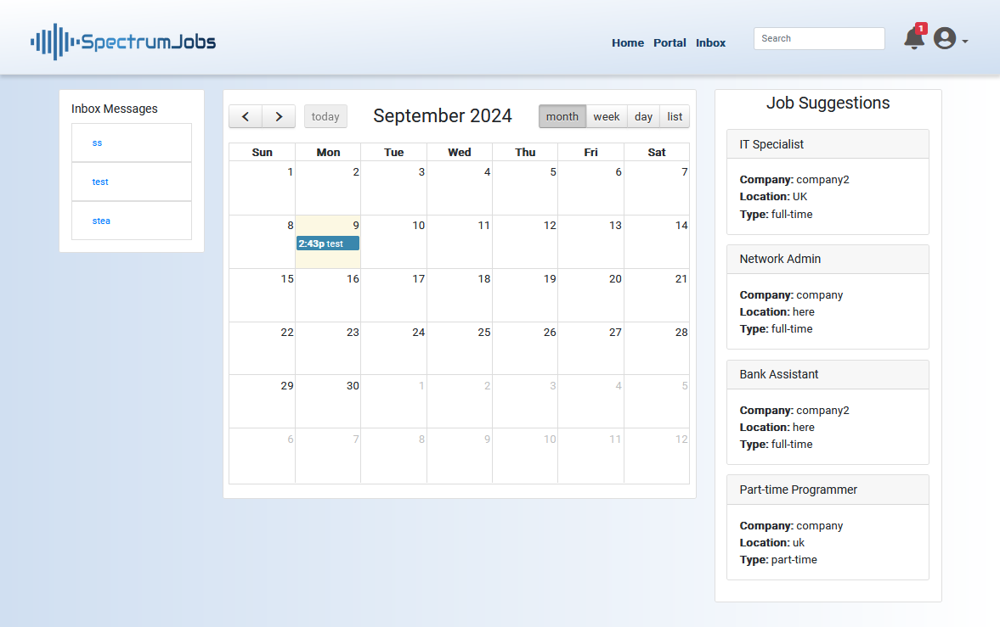
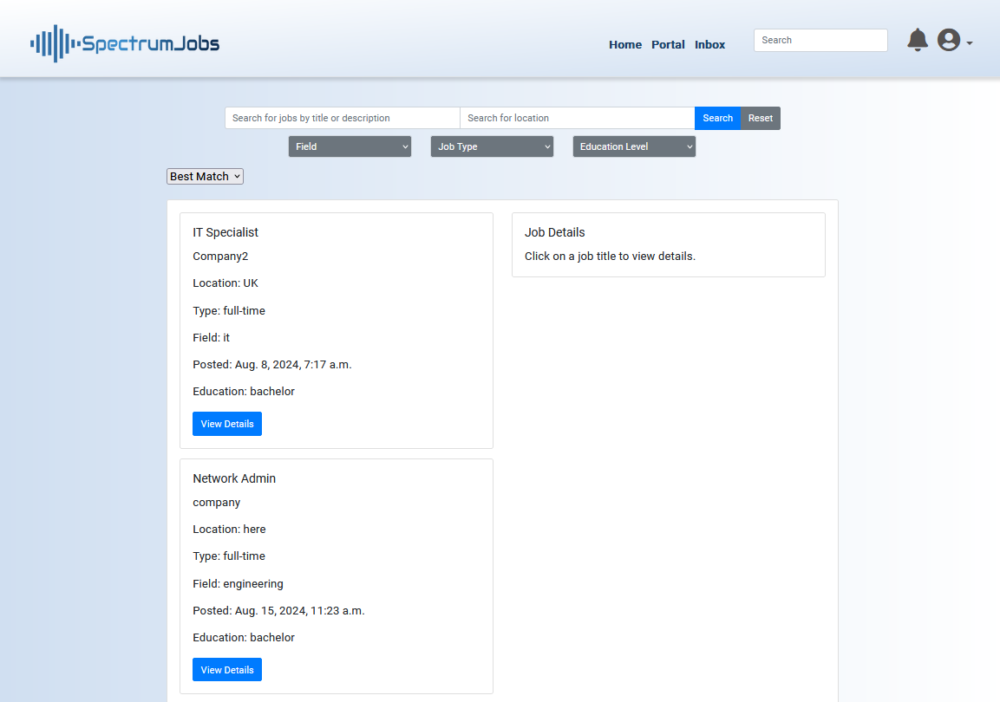
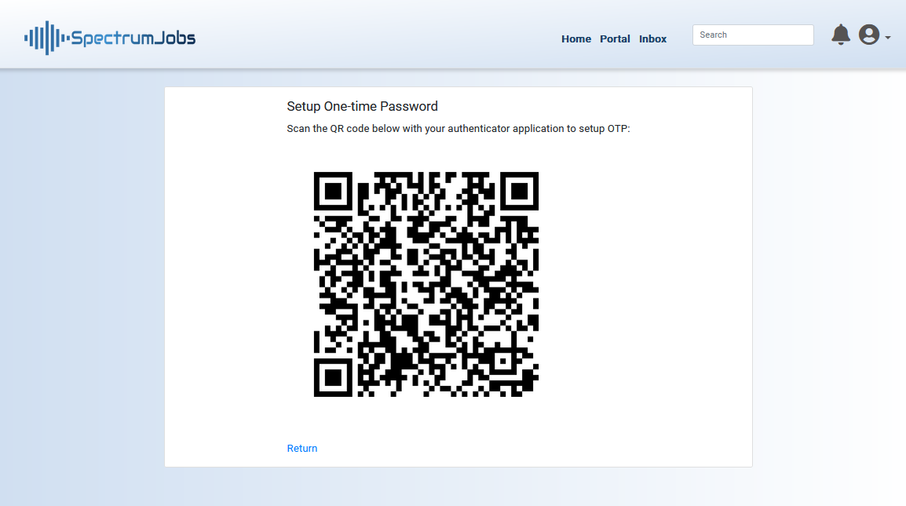
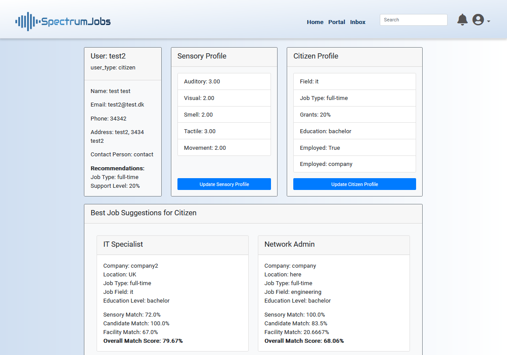

# HFA Job portal 
## Overview
Django-based Job Portal web application for people with high-functioning autism. The platform includes job matching and recommendational capabilities for connecting job seekers with suitable employments. Additiomnally the applications offers continous involvements of a government laision. 

## Key Features
- **Job Matching**: Analyticallt driven job and candidate suggestions based on Pearson's Sensory Profiles, experience and qualificaitons, and emlloyer sensory training level and workplace acommodations and adopability.
- **Ongoing support**: Consists of seeral and overlapping features: appointments and task management, messages, Dlive-chat, monthly feedback reminders, attention needs, recommendations, and notifications.
- **Security**: Session policies is configured to ensure enhanced security using secure cookies and expiration. The password hashing algorithm is specified to use the more secure Argon2 method. 
- **Authentication**: Serving Danish users and dealing with sensitive data, authentication conducted using the MitID authentication method. Simulating the process of MitID for international users is done with social account authentication using django-allauth/Google OAuth 2.0, and one-time passwords using django-otp, PyOTP, and Google Authenticator. 

## Requirements
The required Python packages are listed in the `requirements.txt` file. 
Installation:
```bash
pip install -r requirements.txt
```
#### General Requirements:
Python 3.8+
Django 4.0+
SQLite 3
channel and redis (live chat support)
celery (background tasks like monthly feedback reminders)
django-allauth
django-otp
django-notifications-hq
argon2-cffi

## Google OAuth 2.0
Google OAuth 2.0 API keys are not provided in the code repository. A new instance must be created with the environment variables set either in the bashrc or using the export command in a terminal.


## Running the code 
- **Step 1**: Start redis - ```server sudo service redis-server start```
- **Step 2**: Start Celery and scheduler - ```celery -A job_portal worker --loglevel=info```
- **Step 3**: Active virtual environment - ```source venv/bin/activate```
- **Step 4**: Change directory to 'job_portal' - ```cd job_portal```
- **Step 5**: Start server and open application - ```python3 manage.py runserver 127.0.0.1:8001```


## Additional Notes 
- **Celery**: Remember to have Celery and Celery Beat running to ensure that tasks like feedback reminders are processed correctly
- **Redis**: Redis and Channels is a required service for WebSocket management


## Additional Notes 
This project is licensed under the MIT License.


## Screenshots of application 
&nbsp; 
&nbsp;
#### Authentication

&nbsp; 
&nbsp; 

#### 2FA QR Code generation

&nbsp; 
&nbsp; 

#### Dashboard

&nbsp; 
&nbsp; 

#### Portal

&nbsp; 
&nbsp; 

#### Support dashboard

&nbsp; 
&nbsp; 

#### Profile and best matches

&nbsp; 
&nbsp; 


